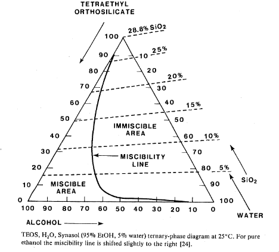

# Phosphorus based, N-type Spin-On-Dopant

## Synthesis
Follow [fangsuwannarak-2019](./fangsuwannarag2019.pdf). 
Synthesized SOD using that method becomes too "jelly-like" after 24 hours. Because we want to use it for longer, we developed a slight modification to the process, internally called FJH (Fangsuwannarak-Joor-Holz). 
It changes from 10:20:3 TEOS:EtOH:H2O to 7:23:3 and 6:24:3.

7:23:3 and 6:24:3 FJH SOD, are better than fangsuwannarak, but still are "jelly-like", after respectively 48 and 96 hours. We also tried 5:15:2, but it's getting "jelly-like" faster than 6:24:3.

Due to FJH SOD still getting immiscible too fast, we'll be testing new proportions 5:24:3, 4:24:3 and 3:24:3.

In file [sod_history](./sod_history.csv) there are ternary proportions to use at site [ternaryplot.com](https://www.ternaryplot.com/), which shows the history of our dopants. 

Chart above shows immiscibility line, which tells when SOD will get "jelly-like".

We are still testing the modified SOD solution and not ready to post any long-term recommendation on which one of the modified few is better.
